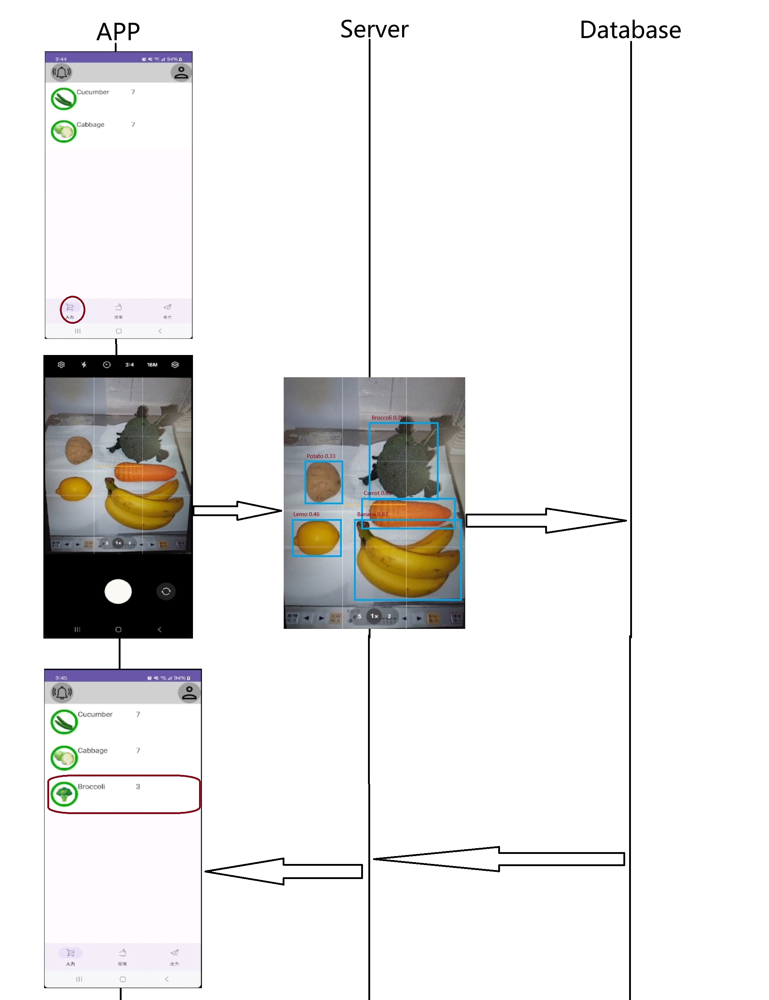

## 背景と開発目的

現代の忙しい生活環境において、冷蔵庫内の食材の管理は困難であり、消費期限の過ぎた食材の無駄や過剰な購入が発生することが一般的です。これにより、食品ロスが増加し、無駄な支出が発生するという問題が生じています。

本システムは、このような問題を解決し、消費期限や食材の管理を効率化することでより快適で持続可能な食生活をサポートすることを目指しています。

---
## システム概要

- 食材の自動認識

スマートフォンで食材の写真を撮影しアップロードするだけで、 AIが自動
で食材を識別し、データベースに登録します 。

- 賞味期限管理
  
登録された食材の賞味期限を自動で管理し、期限が近づくとプッシュ通
知でお知らせします。食品ロスを減らす効果が期待されます。

- レシピ提案
  
冷蔵庫にある食材を基に、 AIが最適なレシピを提案します。「何を作るか
迷う」時間を大幅に削減できます。

---
## まとめ

本システムは、 YOLOを活用した画像解析技術により、スマートフォンで撮影した食材画像を迅速かつ正確に認識し、必要な情報を自動的にデータベースに登録する機能を実現しています。これにより、日常の食材管理が簡便化され、食品ロス削減や節約にもつながるシステムを提供します。

---
## 今後の展望

今後はIoT冷蔵庫との連携機能を強化し、リアルタイムでの食材管理をさらに効率化することを目指します。また、AI技能のさらなる活用に挑戦し、より高度な予測機能やパーソナライズされたレシピ提案など、ユーザー体験の向上を図っていきたいと考えています。

---

